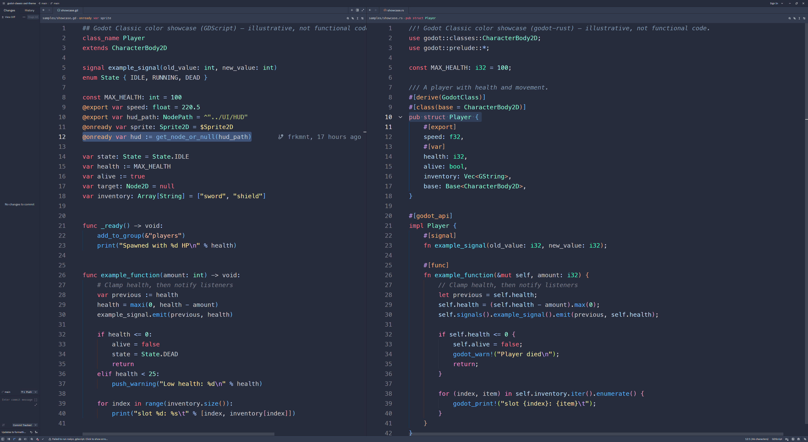
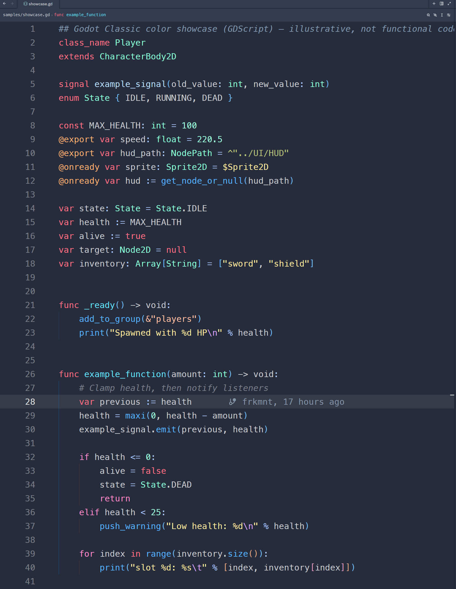
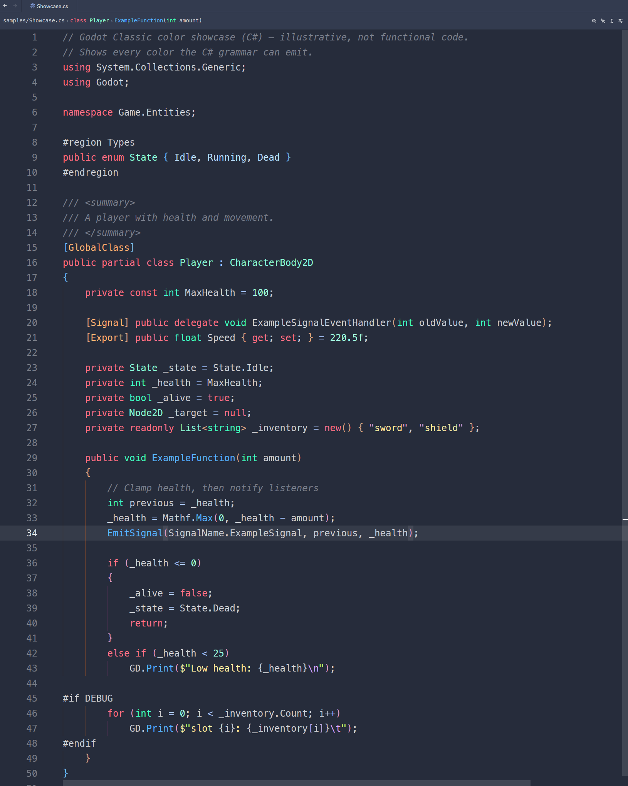
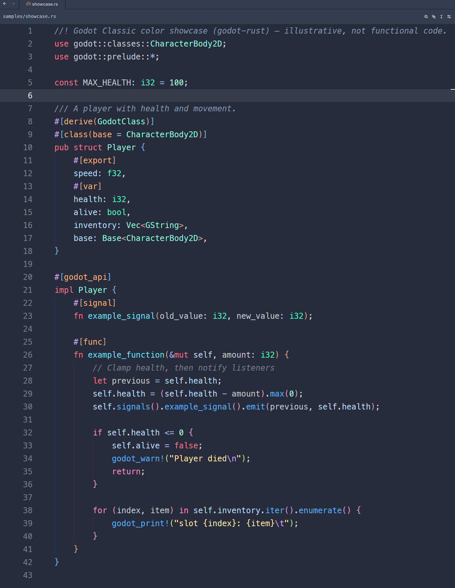

# Godot Classic Theme for Zed

Dark themes for [Zed](https://zed.dev) that mimic the Godot editor. Two
variants:

- **Godot Classic**, the metallic-blue Godot 3.x look
- **Godot 4**, the darker grey-blue 4.x look

Colors are taken from the engine source, so each variant matches its editor.

The same example in GDScript, C# and Rust (sources in [`samples/`](samples)):

  
  
  

## Install

From the registry: command palette → `zed: extensions`, search for **Godot
Classic**, install, then pick a variant in the theme selector (`cmd-k cmd-t` /
`ctrl-k ctrl-t`).

As a dev extension: clone this repo, then `zed: install dev extension` → pick
the folder.

## Syntax highlighting

Highlighting depends on each language's extension. For GDScript, install
[GDQuest/zed-gdscript](https://github.com/GDQuest/zed-gdscript).

Godot 3 has no colors for GDScript 2.0 constructs (annotations, `StringName`,
`NodePath`, doc comments), so Classic borrows Godot 4's for those.

## Colors

| Role             | Godot Classic                                                                  | Godot 4                                                                      |
| ---------------- | ------------------------------------------------------------------------------ | ---------------------------------------------------------------------------- |
| Chrome           |  `#333B4F`        |  `#1D2229`      |
| Docks & panels   |  `#262C3B`        |  `#21262E`      |
| Editor           |  `#262C3B` \*\*\* |  `#1D2229`      |
| Accent           |  `#699CE8`        |  `#70BAFA`      |
| Text             |  `#CCCED3`        |  `#CDCFD2`      |
| Keywords         |  `#FF7085`        |  `#FF7085`      |
| Functions        |  `#57B3FF`        |  `#57B3FF`      |
| Symbols          |  `#ABC8FF`        |  `#ABC9FF`      |
| Members          |  `#BCE0FF`        |  `#BCE0FF`      |
| Built-in types   |  `#42FFC2`        |  `#42FFC2`      |
| Engine types     |  `#8EFFDA`        |  `#8FFFDB`      |
| User types       |  `#C6FFED`        |  `#C7FFED`      |
| Numbers          |  `#A1FFE0`        |  `#A1FFE0`      |
| Strings          |  `#FFECA1`        |  `#FFEDA1`      |
| Strings: escapes |  `#D8A8FF` \*\*   |  `#D8A8FF` \*\* |
| Comments         |  `#CCCED380`    |  `#CDCFD280`  |
| Annotations      |  `#FFB373` \*     |  `#FFB373`      |
| `StringName`     |  `#FFC2A6` \*     |  `#FFC2A6`      |
| `NodePath`       |  `#B8C47D` \*     |  `#B8C47D`      |
| Info             |  `#00D9FF` \*\*   |  `#00D9FF` \*\* |
| Added            |  `#8FFFCF` \*\*   |  `#8FFFCF` \*\* |
| Hidden           |  `#797E8A` \*\*   |  `#797E8A` \*\* |

Unmarked colors come from that version's engine source.

\* ported from Godot 4 (the construct doesn't exist in Godot 3).

\*\* original to this theme (no Godot equivalent).

\*\*\* deviates from the engine color on purpose, for readability.

## Develop

Edit `themes/godot-classic.json` and Zed will live-reload the installed theme on
save.
Bump `version` in `extension.toml` before publishing.

## License

MIT. See [LICENSE](LICENSE).
